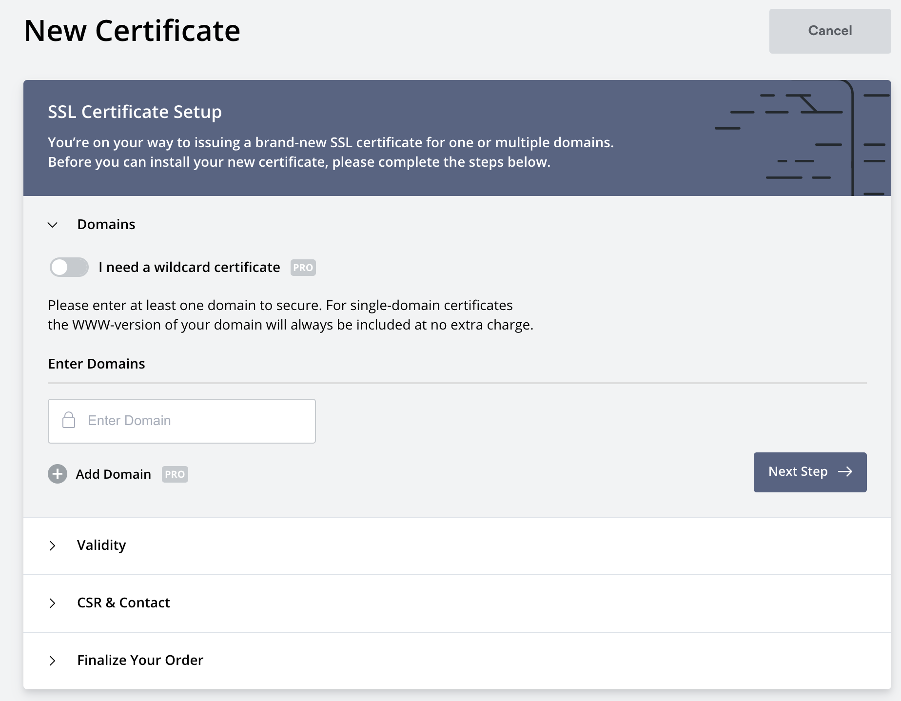
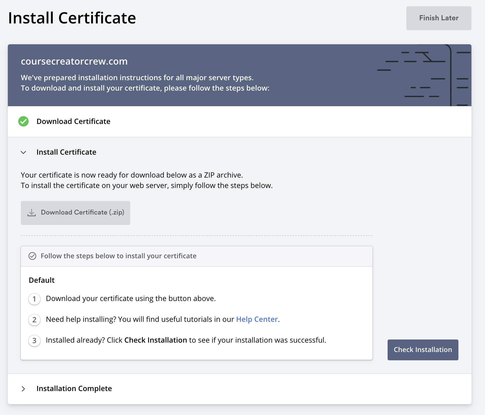

SSL certificates are a must these days. They help protect the data being sent between the server and the client by encrypting it, which gives your website more credibility. In this section we will explore a couple of different ways to obtain SSL certificates and configure the [Istio Gateway](https://istio.io/latest/docs/reference/config/networking/gateway/) to use them.

We will learn how to manually create a self-signed certificate, followed by obtaining a real SSL certificate and how to set that up as well. As you will see, setting all this up is not too complicated.

For you to follow along, you will need an actual, cloud-hosted Kubernetes cluster. This is because we will need an external IP address to hook up a domain name to. Of course, you will also need a domain name.

### Deploying a sample application

To ensure stuff works as it should, we will start by deploying a simple Hello World web application. If you have your own application/service you want to use, feel free to use that, otherwise you can follow along and use the `gcr.io/tetratelabs/hello-world:1.0.0` image.

```sh
kubectl create deploy helloworld --image=gcr.io/tetratelabs/hello-world:1.0.0 --port=3000
```

Next, let's create a Kubernetes Service for it.

```yaml
apiVersion: v1
kind: Service
metadata:
  name: helloworld
  labels:
    app: helloworld
spec:
  ports:
  - name: http
    port: 80
    targetPort: 3000
  selector:
    app: helloworld
```

Copy the above YAML to `helloworld-svc.yaml` and deploy it using `kubectl apply -f helloworld-svc.yaml`.

> Note: if you're wondering why we're not using `kubectl expose` command, it is because we need to name the ports in Kubernetes services (e.g. `http`) and we can't do that through the expose command.

To access the service from an external IP, we also need a Gateway resource:

```yaml
apiVersion: networking.istio.io/v1alpha3
kind: Gateway
metadata:
  name: public-gateway
spec:
  selector:
    istio: ingressgateway
  servers:
    - port:
        number: 80
        name: http
        protocol: HTTP
      hosts:
        - '*'
```

Save the above YAML to `gateway.yaml` and deploy it using `kubectl apply -f gateway.yaml`.

>Note: the hosts field has a value of `*` - we will change this after we create the SSL certificate for the domain name. This is where the actual domain name will go.

Finally, we also need a VirtualService that routes the traffic to the `helloworld` Kubernetes Service:

```yaml
apiVersion: networking.istio.io/v1alpha3
kind: VirtualService
metadata:
  name: helloworld
spec:
  hosts:
    - '*'
  gateways:
    - public-gateway
  http:
    - route:
      - destination:
          host: helloworld.default.svc.cluster.local
          port:
            number: 80
```

Save the above YAML to `helloworld-vs.yaml` and deploy it using `kubectl apply -f helloworld-vs.yaml`.

With all these resources deployed, you can now get the external IP of the Istio's ingress gateway:

```sh
kubectl get svc -l istio=ingressgateway -n istio-system
```

If you open the IP that shows up in the `EXTERNAL-IP` column, you will see something similar to the figure below.


We did get a response back from the application, but we also got the `Not Secure` message from the browser which tells the user that the connection is not secure and doesn't instill a lot of confidence in the website.

### Self-signed certs and manual setup

Let's start with the simplest scenario where we manually obtain the certificate. First thing - pick a domain you want to use - note that to test this, you don't have to own an actual domain name, because we will use a self-signed certificate.

>A self-signed certificate is not signed by a certificate authority (CA). These certificates are used for development and testing, however, they don't provide all of the security features that certificates signed by a CA provide.

I will use `mysuperdomain.com` for my domain name.

```sh
export DOMAIN_NAME=mysuperdomain.com
```

As a first step, we are going to create the root certificate (`$DOMAIN_NAME.crt`) and the private key used for signing the certificate (`$DOMAIN_NAME.key`):

```sh
openssl req -x509 -sha256 -nodes -days 365 -newkey rsa:2048 -subj '/O=$DOMAIN_NAME Inc./CN=$DOMAIN_NAME' -keyout $DOMAIN_NAME.key -out $DOMAIN_NAME.crt
```

The above command creates a `.crt` and a `.key` file.

Next, we need to create the private key and a signing request:

```sh
openssl req -out helloworld.$DOMAIN_NAME.csr -newkey rsa:2048 -nodes -keyout helloworld.$DOMAIN_NAME.key -subj "/CN=helloworld.$DOMAIN_NAME/O=hello world from $DOMAIN_NAME"
```

Finally, we can create the certificate:

```sh
openssl x509 -req -days 365 -CA $DOMAIN_NAME.crt -CAkey $DOMAIN_NAME.key -set_serial 0 -in helloworld.$DOMAIN_NAME.csr -out helloworld.$DOMAIN_NAME.crt
```

Now that you have the certificate and the key, you can create the Kubernetes Secret that will store the certificate and the key.

The secret with certificates must be called `istio-ingressgateway-certs` and be deployed to the `istio-system` namespace. That way, the Istio ingress gateway will load the secret automatically.

```sh
kubectl create secret tls istio-ingressgateway-certs -n istio-system --key helloworld.$DOMAIN_NAME.key --cert helloworld.$DOMAIN_NAME.crt
```

With the secret in place, let's update the Gateway resource and tell it to use this certificate and private key:

```sh
cat <<EOF | kubectl apply -f -
apiVersion: networking.istio.io/v1alpha3
kind: Gateway
metadata:
  name: public-gateway
spec:
  selector:
    istio: ingressgateway
  servers:
  - port:
      number: 443
      name: https
      protocol: HTTPS
    tls:
      mode: SIMPLE
      # These are coming from the istio-ingressgateway-certs secret
      serverCertificate: /etc/istio/ingressgateway-certs/tls.crt
      privateKey: /etc/istio/ingressgateway-certs/tls.key
    hosts:
    - helloworld.$DOMAIN_NAME
EOF
```

Similarly, we need to update the hosts field in the VirtualService with the domain name we set to the `$DOMAIN_NAME` environment variable:

```sh
cat <<EOF | kubectl apply -f -
apiVersion: networking.istio.io/v1alpha3
kind: VirtualService
metadata:
  name: helloworld
spec:
  hosts:
    - helloworld.$DOMAIN_NAME
  gateways:
    - public-gateway
  http:
    - route:
      - destination:
          host: helloworld.default.svc.cluster.local
          port:
            number: 80
EOF
```

The simplest way to test that this works is to use cURL together with the `--resolve` flag. 

The resolve flag has a format of `[DOMAIN]:[PORT]:[IP]` and it routes all requests that match the `[DOMAIN]:[PORT]` portion to the specified IP address. This way you don't need to go to your DNS/domain registrar and make changes there just to be able to test this and you can use a domain that might not even exist.

The IP address in our case is the external IP address of the ingress gateway. Let's save the gateways' IP address to `EXTERNAL_IP` environment variable:

```sh
export EXTERNAL_IP=$(kubectl get svc istio-ingressgateway -n istio-system -o jsonpath='{.status.loadBalancer.ingress[0].ip}')
```

Finally, let's use this cURL command to test that the SSL certs gets verified and used:

```sh
curl -v --resolve helloworld.$DOMAIN_NAME:443:$EXTERNAL_IP --cacert $DOMAIN_NAME.crt https://helloworld.$DOMAIN_NAME
```

With the above command, we are telling cURL to resolve any requests to `helloworld.mysuperdomain.com:443` to the external IP address of the ingress gateway. Additionally, we are providing the name of the CA certificate we created earlier.

From the output you will be able to see the details of the server certificate and a line that says certificate was verified as well as the actual response from the `helloworld` Pod:

```text {hl_lines=[8,10]}
...
* Server certificate:
*  subject: CN=helloworld.mysuperdomain.com; O=hello world from mysuperdomain.com
*  start date: Feb 2 23:32:11 2021 GMT
*  expire date: Feb 2 23:32:11 2022 GMT
*  common name: helloworld.mysuperdomain.com (matched)
*  issuer: O=mysuperdomain.com Inc.; CN=mysuperdomain.com
*  SSL certificate verify ok.
...
Hello World
```

### Real-signed certs and manual setup

The self-signed cert route from the previous section is useful only to kick the tires and test things out. We will need certificates that are signed by an actual certificate authority (CA) that your clients can trust.

There are a couple of ways you can get the SSL certificates. The most popular one is [Let's Encrypt](https://letsencrypt.org/). We will be using [SSL For Free](https://www.sslforfree.com/) which uses Let's Encrypt to issue the certificates. If you want to spend money, you can also purchase SSL certificates from your domain registrar or at [DigiCert](https://digicert.com).

In this section we will use a real domain name and real SSL certificates - this means that if you want to follow along, make sure you have your domain ready to go.

Once you registered a domain, open [SSL for Free](https://sslforfree.com) to get the SSL certificates. Note that you will have to register for a free account in order to create the SSL certificate.

1. Enter your domain name e.g. `mydomain.com` in the text field.
1. Click the Create Free SSL Certificate button.
1. From the dashboard, click the **New Certificate** button.



1. Enter the domain name and click the **Next Step** button.
1. Select the 90-Day certificate option and click Next Step.
1. Confirm auto-generate CSR option and click Next Step.
1. On the last page, select the **Free** option and click Next Step.

Once the certificate is created, we will need to verify the domain name and actually prove we own the domain name we created the SSL certificate for. 

There are 3 options to verify the domain: email verification (make sure you have emails set up on the domain), DNS (CNAME) verification, and HTTP file upload.



You can use any one of these options. I'll be using the CNAME verification. This involves logging in to your domain registrars and setting a CNAME record with a specific value.

**Set the A name record**

While we are logged in to the domain registrars website, let's also create an A record
for the domain that will point to the external IP address of your cluster. 

Since we requested a certificate for mydomain.com and www.mydomain.com, the  A record should point from `mydomain.com` to the IP address.


**Verifying the domain**

After you've set the A record and CNAME we can click the **Verify Domain** button. Note that it might take a while for the values to propagate and for the domain to get verified.

Once the domain is verified the certificate will be issued and you'll be able to download a ZIP package with generated files. 

The package will contain the following files: 

- ca_bundle.crt
- certificate.crt
- private.key

**Re-create the secret**

Let's delete the existing `ingressgateway-certs` secret, and create a new one with real certificates:

```sh
kubectl delete secret istio-ingressgateway-certs -n istio-system
```

We can re-create the Secret with the real SSL certificate and key we got from the downloaded package:

```sh
kubectl create secret tls istio-ingressgateway-certs -n istio-system --key private.key --cert certificate.crt
```

We also need to update the Gateway and the VirtualService to modify the hostnames.

Let's update the Gateway first (make sure you update the `mysuperdomain.com` to your actual domain name):

```sh
cat <<EOF | kubectl apply -f -
apiVersion: networking.istio.io/v1alpha3
kind: Gateway
metadata:
  name: public-gateway
spec:
  selector:
    istio: ingressgateway
  servers:
  - port:
      number: 443
      name: https
      protocol: HTTPS
    tls:
      mode: SIMPLE
      # These are coming from the istio-ingressgateway-certs secret
      serverCertificate: /etc/istio/ingressgateway-certs/tls.crt
      privateKey: /etc/istio/ingressgateway-certs/tls.key
    hosts:
    - mysuperdomain.com
EOF
```

Similarly, make a change to the VirtualService:

```sh
cat <<EOF | kubectl apply -f -
apiVersion: networking.istio.io/v1alpha3
kind: VirtualService
metadata:
  name: helloworld
spec:
  hosts:
    - mysuperdomain.com
  gateways:
    - public-gateway
  http:
    - route:
      - destination:
          host: helloworld.default.svc.cluster.local
          port:
            number: 80
EOF
```

With both of these resources updated, you can open your browser of choice and navigate to the domain. You should see `Hello World!` response and the padlock before the domain name that shows that the website is secure. If you click on the padlock and check the certificate, you will see your domain name in the certificate, as well as the root authority (Let's Encrypt) and the expiration date.