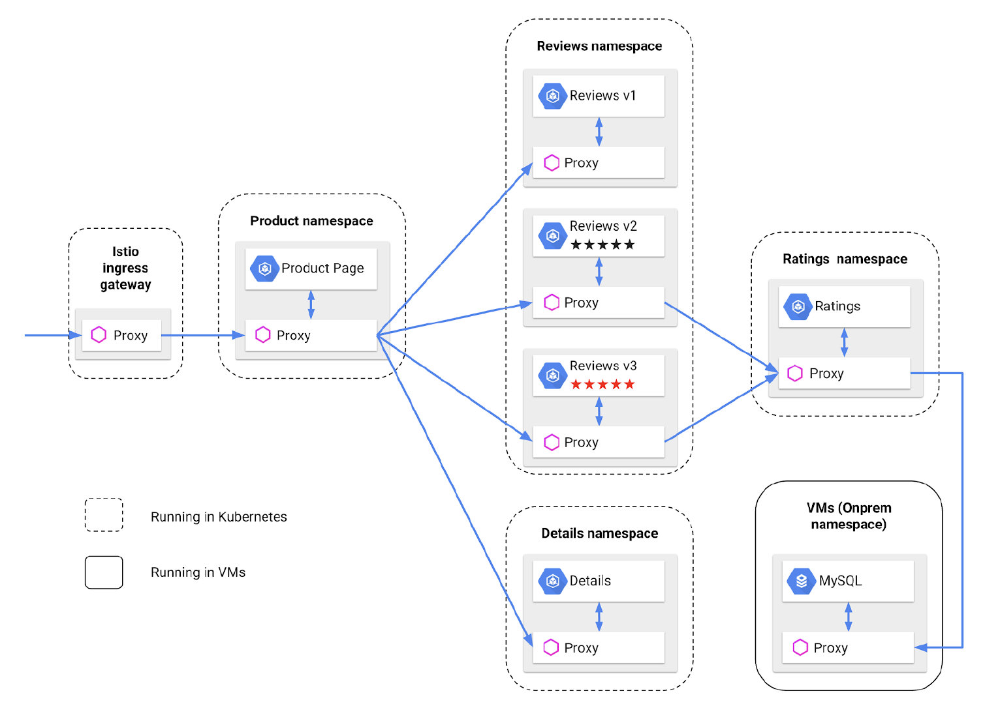

GetIstio 是由 Tetrate 开源的基于 Istio 的发行版。他主要解决了用户使用 Istio 时候的以下痛点：

- Istio 生命周期管理
- 经过测试的安全的 Istio 配置
- 可原生的计算环境支持
- 陡峭的学习曲线及持续支持

想要了解更多关于 GetIstio 的信息请访问 <https://getistio.io>。

本文将从带你动手安装和使用 Istio，包括：

- 在 GKE 上安装 Istio 1.7
- 添加一台虚拟机到 mesh 中
- 部署 Bookinfo 示例
- 集成虚拟机测试
- 升级 Istio 到 1.8

从以上过程中你将了解 Istio 的部署架构、基本功能和操作。

## 准备条件

为了完成动手操作，你需要准备以下环境：

- 一个 Google Cloud 账号，并且其中有足够的余额
- 在本地安装 `gcloud` 工具安装 Istio

这篇博客只适用于 Istio 1.7，1.8 版本的虚拟机整合步骤有变化，请参考 [Istio 文档](https://istio.io/latest/docs/setup/install/virtual-machine/)。

## 安装 Istio

使用 GetIstio 安装 Istio 1.7.5。

```sh
curl -sL https://tetrate.bintray.com/getistio/download.sh | bash
getistio fetch 1.7.5
```

使用 [demo profile](https://istio.io/latest/docs/setup/getting-started/)（包括 Ingress gateway、egress gateway 和 Istiod 所有组件） 安装 Istio：

```text
getistio istioctl install --set profile=demo --set values.global.meshExpansion.enabled=true
Detected that your cluster does not support third party JWT authentication. Falling back to less secure first party JWT. See https://istio.io/docs/ops/best-practices/security/#configure-third-party-service-account-tokens for details.
✔ Istio core installed
✔ Istiod installed
✔ Ingress gateways installed
✔ Egress gateways installed
✔ Installation complete
```

查看 `istio-system` namespace 下的 pod：

```text
kubectl get pod -n=istio-system
NAME                                   READY   STATUS   RESTARTS   AGE
istio-egressgateway-695f5944d8-wdk6s    1/1     Running   0         67s
istio-ingressgateway-5c697d4cd7-4cgq7   1/1     Running   0         67s
istiod-59747cbfdd-sbffx                 1/1     Running   0         106s
```

设置 sidecar 自动注入：

```sh
kubectl label namespace bookinfo istio-injection=enabled
```

部署 [Bookinfo](https://istio.io/latest/docs/examples/bookinfo/) 示例。

```text
kubectl create ns bookinfo
kubectl apply -n bookinfo -f samples/bookinfo/platform/kube/bookinfo.yaml
service/details created
serviceaccount/bookinfo-details created
deployment.apps/details-v1 created
service/ratings created
serviceaccount/bookinfo-ratings created
deployment.apps/ratings-v1 created
service/reviews created
serviceaccount/bookinfo-reviews created
deployment.apps/reviews-v1 created
deployment.apps/reviews-v2 created
deployment.apps/reviews-v3 created
service/productpage created
serviceaccount/bookinfo-productpage created
deployment.apps/productpage-v1 created
```

确认示例部署完成。

```sh
kubectl exec "$(kubectl get pod -n bookinfo -l app=ratings -o jsonpath='{.items[0].metadata.name}')" -n bookinfo -c ratings -- curl -s productpage:9080/productpage | grep -o "<title>.*</title>"
```

正常情况下你将看到这样的显示：

```text
<title>Simple Bookstore App</title>
```

允许外网访问 mesh：

```sh
kubectl -n bookinfo apply -f samples/bookinfo/networking/bookinfo-gateway.yaml
export INGRESS_PORT=$(kubectl -n istio-system get service istio-ingressgateway -o jsonpath='{.spec.ports[?(@.name=="http2")].nodePort}')
export SECURE_INGRESS_PORT=$(kubectl -n istio-system get service istio-ingressgateway -o jsonpath='{.spec.ports[?(@.name=="https")].nodePort}')
echo "$INGRESS_PORT"
echo "$SECURE_INGRESS_PORT"
export INGRESS_HOST=$(kubectl -n istio-system get service istio-ingressgateway -o jsonpath='{.status.loadBalancer.ingress[0].ip}')
echo "$INGRESS_HOST"
export GATEWAY_URL=$INGRESS_HOST:$INGRESS_PORT
echo "$GATEWAY_URL"
```

应用默认的 DestinationRule。

```sh
kubectl apply -n bookinfo -f samples/bookinfo/networking/destination-rule-all.yaml
```

## 向 Istio mesh 中加入虚拟机

我们将在虚拟机中安装 MySQL，并将其配置为 ratings 服务的后台。最终，[bookinfo](https://istio.io/latest/docs/examples/bookinfo/) 示例的拓扑将如下图所示。



我们将在 Google cloud 中创建一台虚拟机，并将它添加到 Istio Mesh 中。假设虚拟机实例的名称是 `instance-1`，首先为虚拟机创建证书。

```sh
kubectl create secret generic cacerts -n istio-system \
    --from-file=samples/certs/ca-cert.pem \
    --from-file=samples/certs/ca-key.pem \
    --from-file=samples/certs/root-cert.pem \
    --from-file=samples/certs/cert-chain.pem
```

安装 Istio mesh 扩展。

```sh
getistio istioctl install \
    -f manifests/examples/vm/values-istio-meshexpansion.yaml
```

在 Cloud shell 中执行以下命令，生成虚拟机扩展的配置文件。

```sh
VM_NAME=instance-1
VM_NAMESPACE=vm
WORK_DIR=vm
SERVICE_ACCOUNT=instance-1
cat <<EOF> "${WORK_DIR}"/vmintegration.yaml
apiVersion: install.istio.io/v1alpha1
kind: IstioOperator
spec:
 values:
   global:
     meshExpansion:
       enabled: true
EOF
getistio istioctl install -f "${WORK_DIR}"/vmintegration.yaml
kubectl create namespace "${VM_NAMESPACE}"
kubectl create serviceaccount "${SERVICE_ACCOUNT}" -n "${VM_NAMESPACE}"
 # 1 hours，注意这个过期时间，这个 token 仅在认证时候使用，后面就不需要了。
tokenexpiretime=3600
echo '{"kind":"TokenRequest","apiVersion":"authentication.k8s.io/v1","spec":{"audiences":["istio-ca"],"expirationSeconds":'$tokenexpiretime'}}' | kubectl create --raw /api/v1/namespaces/$VM_NAMESPACE/serviceaccounts/$SERVICE_ACCOUNT/token -f - | jq -j '.status.token' > "${WORK_DIR}"/istio-token
kubectl -n "${VM_NAMESPACE}" get configmaps istio-ca-root-cert -o json | jq -j '."data"."root-cert.pem"' > "${WORK_DIR}"/root-cert
ISTIO_SERVICE_CIDR=$(echo '{"apiVersion":"v1","kind":"Service","metadata":{"name":"tst"},"spec":{"clusterIP":"1.1.1.1","ports":[{"port":443}]}}' | kubectl apply -f - 2>&1 | sed 's/.*valid IPs is //')
touch "${WORK_DIR}"/cluster.env
echo ISTIO_SERVICE_CIDR=$ISTIO_SERVICE_CIDR > "${WORK_DIR}"/cluster.env
echo "ISTIO_INBOUND_PORTS=3306,8080" >> "${WORK_DIR}"/cluster.env
touch "${WORK_DIR}"/hosts-addendum
echo "${INGRESS_HOST} istiod.istio-system.svc" > "${WORK_DIR}"/hosts-addendum
touch "${WORK_DIR}"/sidecar.env
echo "PROV_CERT=/var/run/secrets/istio" >>"${WORK_DIR}"/sidecar.env
echo "OUTPUT_CERTS=/var/run/secrets/istio" >> "${WORK_DIR}"/sidecar.env
```

将虚拟机配置文件导入到虚拟机实例 `instance-1` 中。使用 ssh 登录到虚拟机实例 `instance-1` 中，将为 Kubernetes 集群和 Istio 生成的文件拷贝到虚拟机的 `$HOME` 目录下。

```sh
sudo apt -y update
sudo apt -y upgrade
sudo mkdir -p /var/run/secrets/istio
sudo cp "${HOME}"/root-cert.pem /var/run/secrets/istio/root-cert.pem
sudo  mkdir -p /var/run/secrets/tokens
sudo cp "${HOME}"/istio-token /var/run/secrets/tokens/istio-token
# Setup Istio on the VM
curl -LO https://storage.googleapis.com/istio-release/releases/1.7.1/deb/istio-sidecar.deb
sudo dpkg -i istio-sidecar.deb
sudo cp "${HOME}"/cluster.env /var/lib/istio/envoy/cluster.env
sudo cp "${HOME}"/sidecar.env /var/lib/istio/envoy/sidecar.env
sudo sh -c 'cat $(eval echo ~$SUDO_USER)/hosts-addendum >> /etc/hosts'
sudo cp "${HOME}"/root-cert.pem /var/run/secrets/istio/root-cert.pem
sudo mkdir -p /etc/istio/proxy
sudo chown -R istio-proxy /var/lib/istio /etc/certs /etc/istio/proxy /var/run/secrets
```

注意：默认情况下虚拟机的防火墙会拒绝对 3306 端口的入站请求，我们需要配置 VPC 中的防火墙规则，以允许 mesh 中的服务访问虚拟机的 3306 端口。

现在可以启动虚拟机中的 Istio 了。

```sh
sudo systemctl start istio
```

## 虚拟机集成测试

在虚拟机中安装 MySQL，并作为服务的后端。

```sh
sudo apt-get update && sudo apt-get install -y mariadb-server
sudo mysql
GRANT ALL PRIVILEGES ON *.* TO 'root'@'localhost' IDENTIFIED BY 'password' WITH GRANT OPTION;
quit;
sudo systemctl restart mysql
curl -q https://raw.githubusercontent.com/istio/istio/release-1.7/samples/bookinfo/src/mysql/mysqldb-init.sql | mysql -u root -ppassword
mysql -u root -ppassword test -e "select * from ratings;"
mysql -u root -ppassword test -e  "update ratings set rating=5 where reviewid=1;select * from ratings;"
hostname -I
# 假如这里获取到的 IP 地址是 <virtual_machine_ip>
```

将虚拟机中的服务注册到 mesh 中。

```sh
getistio istioctl experimental add-to-mesh -n vm mysqldb <virtual_machine_ip> mysql:3306
```

将看到这样的输出：

```text
2020-09-17T11:34:37.740252Z     warn   Got 'services "mysqldb" not found' looking up svc 'mysqldb' in namespace 'vm', attempting to create it
2020-09-17T11:34:38.111244Z     warn   Got 'endpoints "mysqldb" not found' looking up endpoints for 'mysqldb' in namespace 'vm', attempting to create them
```

部署 ratings 服务的 v2 版本，使用 MySQL 作为存储后端。

```sh
kubectl apply -n bookinfo -f samples/bookinfo/platform/kube/bookinfo-ratings-v2-mysql-vm.yaml
kubectl apply -n bookinfo -f samples/bookinfo/networking/virtual-service-ratings-mysql-vm.yaml
```

为部署在虚拟机上的 MySQL 服务添加 DestinationRule、ServiceEntry 和 WorkloadEntry 的配置。

```yaml
apiVersion: networking.istio.io/v1alpha3
kind: DestinationRule
metadata:
 name: mtls-mysqldb-vm
spec:
 host: mysqldb.vm.svc.cluster.local
 trafficPolicy:
   tls:
     mode: ISTIO_MUTUAL
---
apiVersion: networking.istio.io/v1alpha3
kind: ServiceEntry
metadata:
 name: mysqldb-vm
spec:
 hosts:
 - mysqldb.vm.svc.cluster.local
 location: MESH_INTERNAL
 ports:
 - number: 3306
   name: mysql
   protocol: mysql
 resolution: STATIC
 workloadSelector:
   labels:
     app: mysqldb-vm
---
apiVersion: networking.istio.io/v1alpha3
kind: WorkloadEntry
metadata:
 name: mysqldb-vm
spec:
 address: <virtual_machine_ip> #修改为虚拟机的 IP
 labels:
   app: mysqldb-vm
   instance-id: ubuntu-vm-mariadb
```

## 升级到 Isito 1.8

2020 年 11 月 19 日，Istio 1.8 发布，支持使用[ canary](https://istio.io/latest/docs/setup/upgrade/in-place/) 和[ in-place](https://istio.io/latest/docs/setup/upgrade/in-place/) 升级。下面我们将使用 in-place 方式升级 Istio。

```sh
getistio fetch --version 1.8
getistio istioctl upgrade
Confirm to proceed [y/N]?
```

输入 y 确认升级，确认控制平面升级完成后，接下来我们来升级数据平面。

```sh
kubectl rollout restart deployment --namespace bookinfo
```

使用 `getistio istioctl proxy-status -n bookinfo` 命令检查 proxy 的版本，可以看到都已经升级为了 1.8.0。

## 常用命令

以下是在以上操作过程中的常用命令。

**使用 gcloud 命令登录到 Google cloud 的虚拟机**

```sh
gcloud compute ssh jimmy@instance-1 --zone=us-west2-a
```

**清理 bookinfo 示例**

在解压后的 istio 安装包的根目录下执行：

```sh
samples/bookinfo/platform/kube/cleanup.sh
```
